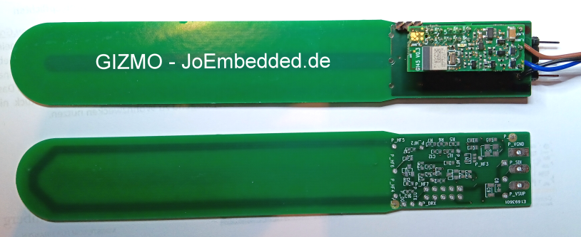

# Gizmo - 'GiessMonitor' #
**Ein LowCost IoT Sensor zur Messung der Bodenfeuchte mit LoRa und/oder BluetoothLE**

Es gibt unzählige Ultra-LowCost-Sensoren zur Messung der Bodenfeuchte.
Die meisten davon taugen aber oft nicht einmal für Hobby-Zwecke.

Das Projekt Gizmo - 'GiessMonitor' möchte einen einfachen, aber trotzdem
für die Praxis geeigneten IoT Sensor entwickeln. Final soll ein LoRa-Modul
eingesetzt werden, so dass Gizmo auch über grosse Entfernungen und selbst mit
einfachen Batterien jahrelang arbeiten kann. 

_*Gizmo ist ein 100% Open Source Projekt!*_
_*Wenn alles klappt, könnte daraus ein spannender und preisgünstiger Sensor für die Allgemeinheit werden*_
_*'Collaborteure' sind jederzeit herzlich willkommen*_

---
**Gizmo_0V1 - Boilerplate und Vor-Prototyp**

Im ersten Schritt geht es aber erst einmal darum das Messverfahren festzulegen.

Es bietet sich an die recht hohe Dielektrizitätskonstante von Wasser auszunutzen. 
Diese ist bis ca. 1 GHz recht konstant (bei ca. 80), hat aber den Nachteil, dass z.B. Salze bei
niedereren Frequenzen (unter ca. 1-10 Mhz) das Signal stark verfälschen
(Details dazu [hier](https://de.wikipedia.org/wiki/Permittivit%C3%A4t) ).

(Technische Anmerkung: Die Menge des vorhandenen Wassers im Boden ist allerdings trotzdem auch immer nur ein indirektes Mass für den 'Giess-Bedarf',
denn die Art des Bodens (z.B. sandig oder eher lehmig) spielt eine fast noch größere Rolle. Aber da diese sich lokal normalerweise nicht ändert,
ist der Wassergehalt als Messwert absolut OK. Gizmo soll ja auch kein wissenschaftliches Messgerät, sondern nur ein (hoffentlich) zuverlässiger Giess-Monitor werden).

Es bietet sich also an, Frequenzen im Bereich >> 1Mhz und < 1Ghz zu verwenden. Als Sensorelement wir die Kapazität einer kleinen 
Kupferfläche (die später in einer korrosionsgeschützen Innenlage der PCB verschwinden wird) verwendet und ganz grob ca. 10pF - 100pF beträgt.
Je stärker das Anregungssignal ist, desto günstiger wird auch die Messung. Aber schnell kann daraus auch ein nicht CE-konformer Sender werden.
Daher sind auf dem Gizmo_0V1 mehrere verschiedene Mess- und Anrgeungs-Systeme vorgesehen (Details dazu folgen). 

In Europa gelten auf diesen Frequenzen etwas lockerere Vorschriften (ERP = Effektiv abgestrahlte Leistung):
- 26.957 - 27.283 MHz: CB-Band
- 87.5 - 108 MHz: max. 50nW ERP 
- 40.660 – 40.700 MHz: max. 10 mW ERP
- 169.400 – 169.8125 MHz: 3 Bänder, mit max. >= 10mW

Speziell das 169Mhz 'SRD'-Band erscheint recht vielversprechend... Tests werden es zeigen ;-)

[Gizmo_0V1 - PCB, Layouts und Schaltpläne im Ordner 'docu']

---
**Gizmo - der Plan**
- Tests und festlegung des Messsystems: Dazu PCB mit LowCost BlE Modul und Speicher (als Logger) layoutet.
- Erste Software (basierend auf Open-SDI12-Blue-Modulen und JesFs)
- Finalisierung einer PCB V1.0 (Multilayer mit korrosiongeschützer Sensorfläche), LoRa-Modul und 3D-gedrucktem Batteriefach
- ANbindung an z.B. das Community LoRa-Netz TTN
- Kleine APP (basierend auf BLX.JS) für die praktische Nutzung
- ...

---
## Changelog  ##
- V0.1  Gizmo Prototype als PCB gefertigt
---

