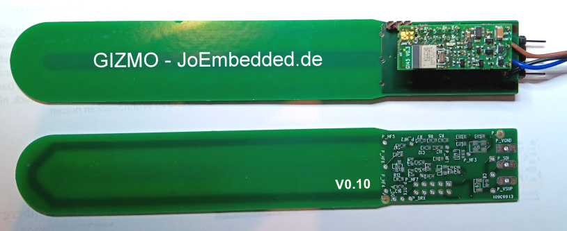

# Gizmo - 'GiessMonitor' #
**Ein LowCost IoT Sensor zur Messung der Bodenfeuchte mit LoRa und/oder SDI-12/BluetoothLE**

Es gibt unzählige Ultra-LowCost-Sensoren zur Messung der Bodenfeuchte.
Die meisten davon taugen aber oft nicht einmal für Hobby-Zwecke.

Das Projekt Gizmo - 'GiessMonitor' möchte einen einfachen, aber trotzdem
für die Praxis geeigneten IoT Sensor entwickeln. Final soll ein LoRa-Modul
eingesetzt werden, so dass Gizmo auch über grosse Entfernungen und selbst mit
einfachen Batterien jahrelang arbeiten kann. 

_*Gizmo ist ein 100% Open Source Projekt!*_
_*Wenn alles klappt, könnte daraus ein spannender und preisgünstiger Sensor für die Allgemeinheit werden.*_
_*'Collaborteure' sind jederzeit herzlich willkommen!*_

---
**Gizmo_0V15 - Boilerplate und Vor-Prototyp**

Im ersten Schritt geht es aber erst einmal darum das Messverfahren festzulegen.

Es bietet sich an die recht hohe Dielektrizitätskonstante von Wasser auszunutzen. 
Diese ist bis ca. 1 GHz recht konstant (bei ca. 80), hat aber den Nachteil, dass z.B. Salze bei
niedereren Frequenzen (unter ca. 1-10 Mhz) das Signal stark verfälschen.
(Details dazu: [Permitivität von mineralisiertem Wasser](https://de.wikipedia.org/wiki/Permittivit%C3%A4t). Die Permitivität setzt sich aus der 
Dielektrizitätskonstante (Realteil) und dem störenden Leitwert (Imaginärteil) zusammen).

(Technische Anmerkung: Die Menge des vorhandenen Wassers im Boden ist allerdings trotzdem auch immer nur ein indirektes Mass für den 'Giess-Bedarf',
denn die Art des Bodens (z.B. sandig oder eher lehmig) spielt eine fast noch größere Rolle. Aber da diese sich lokal normalerweise nicht ändert,
ist der Wassergehalt als Messwert absolut OK. Auch ist der Salzgehalt nicht von Interesse, einzig nur sollte er das Signal möglichst wenig verfälschen.
Gizmo soll ja auch kein wissenschaftliches Messgerät, sondern nur ein (hoffentlich) zuverlässiger Giess-Monitor werden).

Es bietet sich also an, Frequenzen im Bereich > 10 Mhz und < 1Ghz zu verwenden. Als Sensorelement wird die Kapazität einer kleinen 
Kupferfläche (die in einer korrosionsgeschützten Innenlage der PCB geschützt ist) verwendet und ungefähr ca. 10pF - 80pF beträgt.
Je stärker das Anregungssignal ist, desto günstiger wird auch die Messung. Aber schnell kann daraus auch ein nicht CE-konformer Sender werden.

Nach wissenschaftlichen Referenzstudien ähnlicher Sensoren (u.a. [Measurement of Soil Water Content with a 50-MHz Soil Dielectric Sensor – Seyfried & Murdock, 2004](https://www.researchgate.net/publication/43261344_Measurement_of_Soil_Water_Content_with_a_50-MHz_Soil_Dielectric_Sensor) ) eignet sich das weltweit freie ISM-Band 40.660 – 40.700 MHz dazu sehr gut.

Die Geometrie der Sensorfläche muss für einen kapazitiven Sensor aber jedezeit unter der Lambda/4-Länge liegen, bei einer max. Dielektrizitätskonstante von 80 wären das bei 40 Mhz ca. 21 cm. Eine erste Simulation mit FEMM ergab ca. 10 cm als gut geeignet. Die Kupferflächen werden korrosionsgeschützt symetrisch auf den beiden Innenlagen platziert, Details zur Geometrie im Schaltplan.

[Sensorsimulation](./docu/sensorsim01.png) die erste mit FEMM simulierte Geometrie kam dem Ergebnis schon recht nahe.

Die Frage war auch, ob das 40 Mhz Signal störende Oberwellen abstrahlt (diese sind in der DIN EN 55011 / CISPR 11 definiert). Eine Freifeld-Messung ergab aber keinerlei Auffälligkeiten, selbst auf der Grundfrequenz ist die Abstrahlung noch leicht unterm allgemeinen Grenzwert, wenn also ein 40.68 MHz Oszillator verwendet wird, ist Gizmo in jedem Fall absolut im erlaubten Bereich: [EMV Messung](./docu/emv_girmo_pre.png).

  Die erste Version arbeitet mit SDI-12 und Bluetooth (Modul: [Open-SDI12-Blue](https://github.com/joembedded/Open-SDI12-Blue) )

[Gizmo_0V1 - PCB, Layouts und Schaltpläne im Ordner 'docu'](./docu/)

---
**Gizmo - der Plan**
- Tests und Festlegung des Messsystems: Dazu PCB mit SDI-12 und Bluetooth.
- Erste Software (basierend auf Open-SDI12-Blue-Libs und JesFs)
- Finalisierung V1.0 mit LoRa-Modul und 3D-gedrucktem Batteriefach
- Problemlose Anbindung an z.B. das Community LoRa-Netz TTN oder ChirpStack
- ...

---
## Changelog  ##
- 01.04.2023 V0.01 Gizmo Prototyp als PCB in Fertigung gegeben
- 07.04.2023 Erste elektrische Tests der PCB V0.01
- 15.05.2025 Gizmo V0.15 SDI-12 und Bluetooth
---

